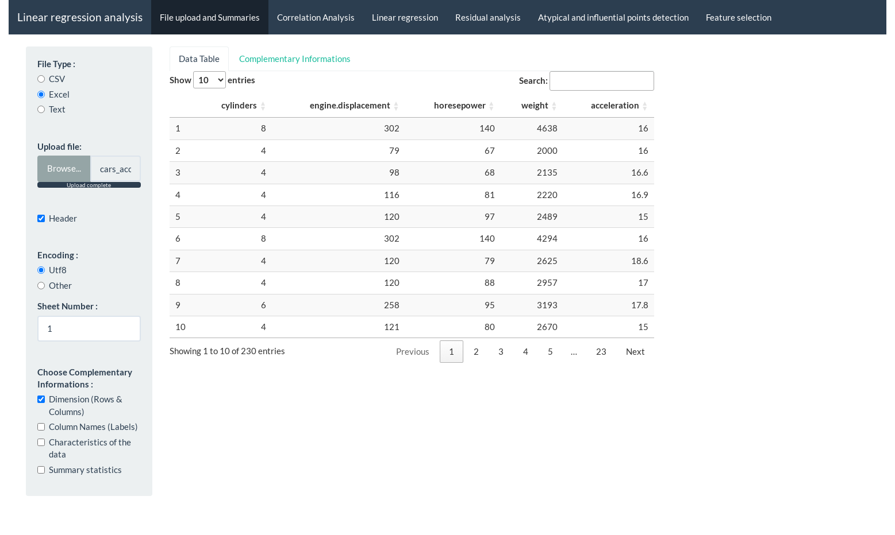

## Linear Regression Analysis - Web application modularized using R/R Shiny and Docker

This application is able to :

-   upload the excel or cvs/txt file.
-   analyze of the correlation (Pearson) between two numerical variables.
-   analyze of the linear regression (simple or multiple).
-   analyze of the residual based on the graphical of residual, the QQ-norm and the Jarque-Bera test.
-   detect the atypical and influential points in our data based on the studentized residual and the sense of lever.
-   select the best feature based on the AIC (Akaike) and BIC (Schwartz) criterion.

#### Tools and language used during the realization :

-   os : Ubuntu
-   tools : RStudio and Docker Desktop
-   language : R
-   packages : R Shiny and shinytest2

 
